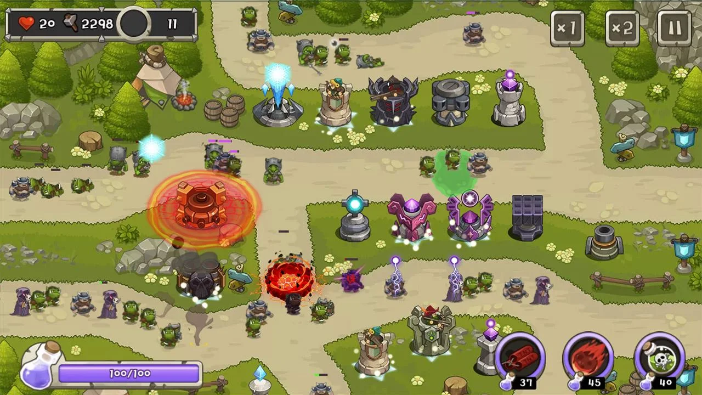
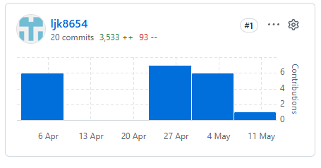

# Random unit Defense

## High Concept
랜덤으로 유닛을 소환하고, 스킬을 활용하여 적의 웨이브를 막는 타워 디펜스 게임

# git commit

 

# Activity 구성

 - 타이틀 화면 MainActivity 에서 RUDActivity가 실행이 되게 구현
 - 게임 Activity 를 가로로 고정하여 회전을 하여도 전환되지 않도록 고정

# Scene 구성 및 전환 관계

- MainScene과 PauseScene이 있으며 MainScene에서 자원, 유닛소환, 체력을 구성을 하고 PauseButton을 누르면 PauseScene으로 전환이 되어 음량 조절 및 나가기를 할 수 있게 한다.
- 승리를 하면 승리화면을 띄우는 Scene이 나옴

# MainScene 에 등장하는 game object 들
Tower(개별적인), collisionChecker, Enemy, RandomTower, Arrow와 같은 투사체, skill

Archer Tower class

- 궁수 이미지로 표시되는 타워 유닛
- attack, target on class 보유
- target on에서 적을 정하고 attack에서 범위에 있으면 Arrow를 생성하여 공격을 하고 공격 범위를 나가면 update함수에서 적을 null로 바꿈

희귀 Tower class

- attack, target on class 보유
- target on에서 적을 정하고 attack에서 범위에 있으면 투사체를 생성하여 공격을 하고 공격 범위를 나가면 update함수에서 적을 null로 바꿈

유니크 Tower class

- attack, target on class 보유
- target on에서 다수의 적을 정하고 attack에서 범위에 있으면 다수의 투사체를 생성하여 공격을 하고 공격 범위를 나가면 update함수에서 적을 null로 바꿈

전설 Tower class

- attack, target on class, skill, gauge 보유
- target on에서 다수의 적을 정하고 attack에서 범위에 있으면 다수의 투사체를 생성하여 공격을 하고 공격 범위를 나가면 update함수에서 적을 null로 바꿈
- MainScene에서 타워를 클릭하면 스킬이 나가 투사체를 변경

Arrow class

- 화살 이미지의 투사체
- 궁수 타워한테 적을 이어받은 후 update 함수에서 시간에 따른직선 함수를 사용하여 적을 쫓아 추격

Enemy class

- 미리 지정한 길을 따라 가는 class

CollisionChecker class

- 타워 공격 범위에 적이 들어오면 타워의 target on 함수에 적을 넘겨 적을 지정하게 하고 투사체가 적에게 닿으면 저거 되게 함

Enemy road class

- 적이 길을 따라 이동한는 경로를 설정하는 class

randomTower class

- ?의 이미지 표시되는 이미지 class
- MainScene에서 사용자가 이미지를 클릭하고 드래그 하면 랜덤한 유닛이 드래그와 드랍 되게 함.(MainScene에 구현)

Coin class

- player의 자원을 저장하는 class

Skill class

- 전체 적을 공격, 일정시간 동안 타워 공격력을 증가 시키는 class

# 현재까지의 진행 상황

 프로젝트 기본 구조: 80% 

 배경 및 맵 구성: 30% -> 배경 이미지

 유닛 생성 시스템: 70% ->  궁수 타워 생성 및 드래그 배치 구현 

 적 이동 시스템: 0%

 유닛 공격 시스템: 60% -> 적을 지정하여 화살을 발사하게 구현

 UI 구성: 30%

 웨이브 시스템: 0% 

 스킬 시스템: 0% 

 사운드 및 효과: 0% 

# UX 진행 방법
임의의 자원을 사용 -> randomTower 이미지를 클릭 후 -> tower를 드래그 후 배치 -> 웨이브 동안 적을 막음 -> 승리